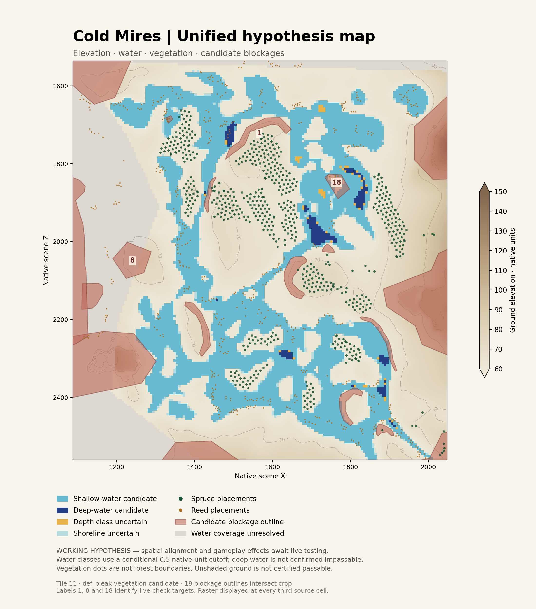

# Cold Mires: unified hypothesis dataset v1

Four candidate terrain layers in one local scene coordinate frame: elevation,
water, vegetation placements, and blockage outlines. This is a queryable
research snapshot for issue #39, not a verified navigation map.

## Use

Requires Python 3.10 or later and NumPy. From the repository root:

```sh
python scripts/cold_mires/query_map.py point 1820 1892 --radius 20
python scripts/cold_mires/query_map.py region 1700 1800 1850 2000
python scripts/cold_mires/query_map.py summary
python scripts/cold_mires/test_map.py
```

Read [EXTRACTION.md](EXTRACTION.md) for the complete source rebuild, rendering,
re-extraction procedure and live checklist. Read [schema.json](schema.json)
and [validation.json](validation.json) before interpreting queries.

All query commands return JSON. No game installation, network
connection, or image interpretation is needed. Import `Map` from `query_map.py`
for the same `point(x,z,radius)` and `region([xmin,zmin,xmax,zmax])` functions.

## Files and coordinates

- `dataset/manifest.json`: schema, source hashes, calibration assumptions, coverage,
  selection status and limitations. Named sources link query output to evidence.
- `dataset/rasters.npz`: full 512 × 480 source crop; ground and water surface heights,
  plus original unsigned 16-bit samples. Sampling interval: 2 native units.
- `dataset/features.json`: vegetation points (including model paths and opaque bytes),
  candidate polygons, go/no-go context, and building placement origins.
- `scripts/cold_mires/` at repository root: decoding, build, query, classification,
  rendering and regression tests.
- `dataset/examples.json`, `dataset/decode_report.json`: generated examples and decode evidence.
- `dataset/map.png`: human-readable illustration sampled every third raster cell.



X increases across columns and Z down rows. The first retained sample is
(1088,1536); the last is (2046,2558). The query domain is the half-open rectangle
[1088,2048) × [1536,2560). Point queries use the lower grid sample and report its
coordinate; they do not claim subcell precision. Region counts use sample
coordinates inside a half-open box. Polygon intersection uses a closed box and
includes boundary contact; point-in-polygon includes polygon edges. These
conventions are explicit because a sample count is not an exact area measurement.

This is a local scene frame, not geographic coordinates. Do not treat the point
and polygon JSON as longitude/latitude GeoJSON. Crop alignment, orientation and
native-unit equivalence to metres have not been verified in-game.

## Interpreting answers

Elevation is a decoded measurement under the recorded calibration hypothesis.
Water classes use a conditional 0.5 native-unit depth cutoff and a quantization
uncertainty band. Raw-zero water stays unknown; lack of a predicted exposed
surface does not establish dry or passable ground in the game.

Vegetation searches report placement points within a caller-specified radius.
That radius is a search radius, not a canopy or concealment radius. Searches near
crop edges are incomplete because vegetation outside the crop is not packaged.
Spruce/reed/other labels come from model names. The def_bleak set is the leading
selection candidate; emp_highlands is not combined with it.

Blockage polygons retain their source IDs and full coordinates even where they
extend outside the crop. Building points do not encode collision footprints.
The broad go polygon and terrain no-go outlines are preserved as context but are
not combined into a traversability verdict. No-go overrides, model collision,
prefab composition, forest classification and runtime pathfinding remain open.

Every query therefore returns passability, concealment and projectile obstruction
as **unknown**, regardless of which candidates overlap. A candidate polygon hit
is useful evidence to test; an empty hit list is not permission to route through.

## Live-check targets

The illustration labels source outlines 1, 8 and 18: curved ridge, rock cluster,
and isolated outcrop. Test crossing and going around their edges, formation-width
effects in nearby gaps, shallow/deep-water candidates, and spruce versus reed-only
concealment. Test firing separately from movement. Consolidated checks remain in
issue #39. This PR is the scoped Cold Mires research package, not completion of
the general battlefield work in issue #9.
